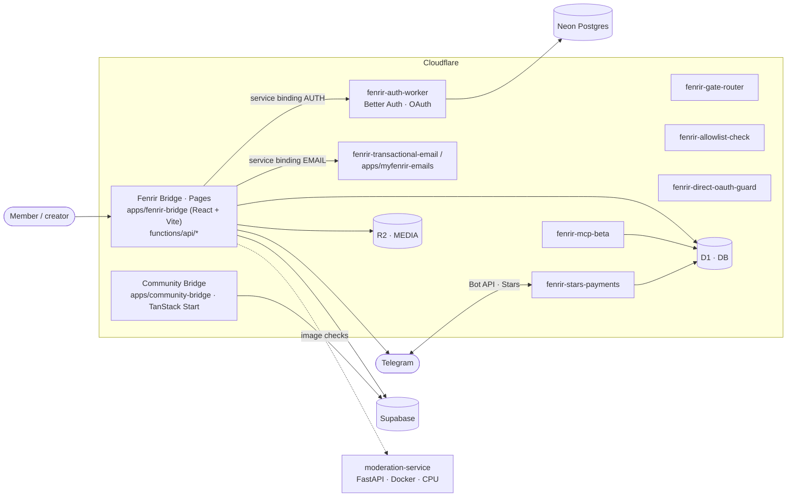
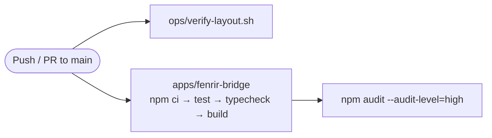

<p align="center">
  
</p>

<h1 align="center">Fenrir Unified</h1>

<p align="center"><b>MyFenrir monorepo — Community Gate, Fenrir Bridge web app, Cloudflare Workers, transactional email and moderation</b></p>

<p align="center">
  <a href="https://github.com/FriskyDevelopments/fenrir-unified/actions/workflows/quality.yml"></a>
  
  
  
  
  
  
</p>

The consolidation target for the **Fenrir / MyFenrir** product family. MyFenrir runs community access, gating and Telegram integrations for creator and adult communities. This monorepo joins the working surfaces into one tree. **Fenrir Bridge** is the primary web app, a React/Vite build on Cloudflare Pages with Pages Functions for auth, readiness, Telegram, billing, rooms and the community gate. Alongside it sit a set of single-purpose Cloudflare Workers, the **Community Bridge** app (TanStack Start), a branded **transactional email** Worker, a self-hosted CPU-only **image moderation service**, a Remotion **cinema** sidecar for walkthrough videos, shared auth and brand packages, and QA tooling. It is for the Fenrir team operating and shipping MyFenrir. The history is in the migration from GitLab.

## Architecture



### CI quality gate



## Stack

- **Web:** React + Vite + TypeScript (Fenrir Bridge), TanStack Start + Radix (Community Bridge), Tailwind CSS
- **Edge:** Cloudflare Pages + Pages Functions, Workers, D1, R2, service bindings, Turnstile; Wrangler 4 (run through Deno in scripts)
- **Auth & data:** Better Auth (`packages/auth`), WebAuthn, Google / Microsoft / Apple OAuth, Neon Postgres, Supabase
- **Payments:** Telegram Stars (primary launch lane), Stripe (optional standby)
- **Other:** Remotion (fenrir-cinema), Python FastAPI + transformers (moderation-service), Apify + Playwright (QA runner), PostHog

## Project structure

```text
apps/
  fenrir-bridge/        primary MyFenrir app: src/, functions/ (Pages Functions), workers/, wrangler.*.toml
  community-bridge/     Community Gate app (TanStack Start, Supabase, Neon)
  myfenrir-emails/      branded transactional + auth email Worker
  moderation-service/   self-hosted CPU image classifier (FastAPI, Docker)
  fenrir-cinema/        Remotion admin-guide / walkthrough videos
packages/
  auth/                 @frisky/auth (Better Auth config)
  gate-brand/           @frisky/gate-brand presets
tools/                  QA runners, human verification, quality boundaries
ops/                    import, verification, GitLab and deploy helpers
docs/                   architecture, audits, auth cutover notes
legacy/                 older static portal, reference only
```

## Local development

```bash
# Primary app (shared auth: npm ci in packages/auth first)
cd apps/fenrir-bridge && npm install

# Vite dev server
npm run dev

# Vitest + node:test suites
npm test

# TypeScript
npm run typecheck

# Production build
npm run build

# Cloudflare tooling check (must be green before any deploy)
npm run wrangler:check
```

Other apps have their own scripts: `apps/community-bridge` (`npm run dev`, `npm run build`, `npm run preflight:production`), `apps/myfenrir-emails` (`npm run dev`, `npm test`, `npm run deploy`), `apps/fenrir-cinema` (`npm run dev` for Remotion Studio). `apps/moderation-service` ships a `Dockerfile` and `docker-compose.yml`.

## Environment variables

Names only. Copy the matching example file and fill in values locally. Never commit secrets.

**apps/fenrir-bridge/.env.example (build + Pages Functions)**

`VITE_AUTH_REDIRECT_ORIGIN`, `VITE_FENRIR_TELEGRAM_BOT_USERNAME`, `VITE_COMMUNITY_BRIDGE_DASHBOARD_URL`, `SESSION_SECRET`, `HUMAN_VERIFICATION_HMAC_SECRET`, `SUPABASE_URL`, `SUPABASE_SERVICE_ROLE_KEY`, `NEON_DATABASE_URL`, `BETTER_AUTH_SECRET`, `FENRIR_COMMUNITY_AUTH_SECRET`, `FENRIR_CANONICAL_ORIGIN`, `FENRIR_ALLOWED_ORIGINS`, `GOOGLE_CLIENT_ID`, `GOOGLE_CLIENT_SECRET`, `MICROSOFT_CLIENT_ID`, `MICROSOFT_CLIENT_SECRET`, `APPLE_CLIENT_ID`, `APPLE_TEAM_ID`, `APPLE_KEY_ID`, `APPLE_PRIVATE_KEY`, `TURNSTILE_SITE_KEY`, `TURNSTILE_SECRET_KEY`

**apps/fenrir-bridge/workers/fenrir-auth/.dev.vars.example**

- `DATABASE_URL`
- `BETTER_AUTH_SECRET`
- `SESSION_SECRET`

**apps/community-bridge/.env.example**

- `VITE_SUPABASE_URL`
- `VITE_SUPABASE_PUBLISHABLE_KEY`
- `VITE_SITE_URL`

**apps/myfenrir-emails/.dev.vars.example**

- `SEND_AUTH_TOKEN`
- `RESEND_API_KEY`
- `MAILERSEND_API_KEY`

## Deploy

- **Fenrir Bridge** deploys to Cloudflare Pages as project `fenrir-bridge` (`pages_build_output_dir: dist`) with D1 (`DB`), R2 (`MEDIA`) and service bindings to `fenrir-auth-worker` and `fenrir-transactional-email`. Use `npm run deploy` / `npm run deploy:ci`, both guarded by `scripts/guard-wrangler-deploy.sh`.
- Each Worker has its own `wrangler.fenrir-*.toml` (or `.jsonc`) in `apps/fenrir-bridge/`: stars payments, gate router, allowlist check, direct-OAuth guard, MCP beta and transactional email.
- **myfenrir-emails** deploys with `npm run deploy` / `npm run deploy:production` (see its `DEPLOY.md`).
- **Community Bridge** builds with the Cloudflare Vite plugin (`wrangler.jsonc`).
- **moderation-service** is self-hosted through Docker.

The `Quality` workflow gates every PR and push to `main`.

## Important Separation Rules

Fenrir is not the Gemini bot repo. Gemini can be the optional mind/concierge layer, but Fenrir owns auth, access, payment state, and deployment truth.

The current launch lane is Telegram Stars plus D1/Worker entitlement state. Stripe can stay as an optional standby integration, but it should not block the non-Stripe launch path.

## Materialize The Code

Run this after FileProvider/iCloud/Google Drive has hydrated the source folders:

```bash
bash ops/materialize-from-sources.sh
```

That script copies source-controlled project files and skips secrets, generated output, local caches, and dependency folders.

## Verify

For the GitLab seed layout:

```bash
bash ops/verify-layout.sh
```

For the full GitLab handoff gate:

```bash
bash ops/audit-gitlab-readiness.sh
```

For the primary app:

```bash
cd apps/fenrir-bridge
npm install
npm run wrangler:check
npm run verify:prod
npm run build
```

Do not run a Cloudflare deploy until `npm run wrangler:check` is green.

## Push To GitLab

Create an empty GitLab project, then connect this local repo:

```bash
bash ops/configure-gitlab-remote.sh <gitlab-remote-url>
git push -u origin main
bash ops/audit-gitlab-readiness.sh
```

If direct network push is unavailable, create an import bundle:

```bash
bash ops/create-gitlab-bundle.sh
```

If `glab` is authenticated and network access is available, create the private GitLab project and push in one step:

```bash
bash ops/create-gitlab-project-and-push.sh <namespace>/fenrir-unified
```
