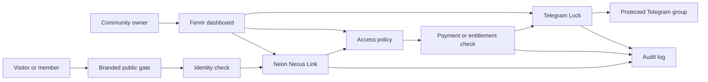
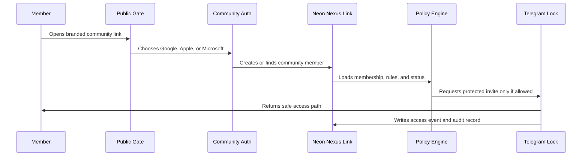
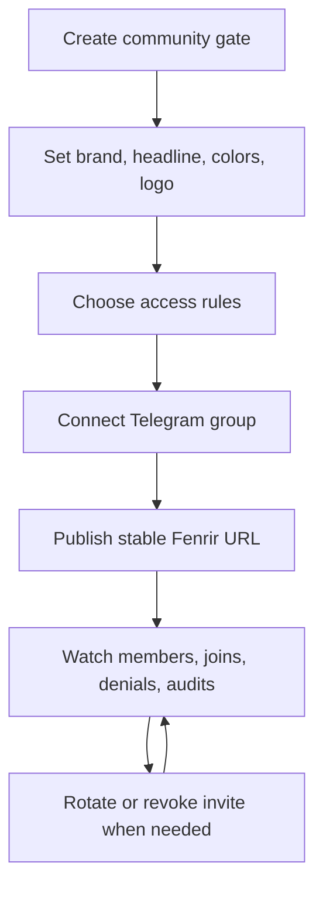

# Fenrir Bridge Layer: Neon Nexus Link Explainer

## The Short Version

Fenrir Bridge is the front door for protected communities.

It gives a group owner one clean, branded access link. Behind that link, Fenrir checks identity, payment, community rules, Telegram status, and invite safety before anybody reaches the real group.

The important idea is simple:

```text
One link for the human.
One control plane for the owner.
One audit trail for the system.
One protected Telegram community behind it.
```

Neon Nexus Link is the community identity and state layer inside that story. It connects the public gate, the member session, the admin dashboard, and the database record that says who belongs to which community.

## Why This Exists

Telegram invite links are too fragile for serious communities.

They get leaked. They get copied. They are hard to rotate cleanly. They do not explain who is allowed in, why they were allowed in, whether they paid, whether they were reviewed, or whether they still belong.

Fenrir turns a raw invite into a managed access system:

- The public sees a stable branded URL.
- The owner sees controls, members, status, and logs.
- The backend owns the real invite lifecycle.
- The community can change rules without changing the public link.
- Access becomes revocable, observable, and explainable.

That is the bridge: not just a redirect, but a trust checkpoint between the outside world and the protected group.

## The Mental Model

Think of Fenrir as five layers stacked together:

| Layer | What it does | Plain-language meaning |
| --- | --- | --- |
| Public Gate | Shows the branded community access page | "This is where members knock." |
| Identity Gate | Verifies the person with Google, Apple, or Microsoft | "Who are you, through a trusted provider?" |
| Neon Nexus Link | Stores community membership and gate state | "Which community do you belong to, and what is your status?" |
| Payment and Entitlement Gate | Checks Stars, Stripe, plan, or owner rules | "Are you allowed to unlock this?" |
| Telegram Lock | Rotates, revokes, and protects the real Telegram invite | "Here is the door, but only when Fenrir says yes." |

Fenrir is the control plane across those layers.

Gemini can help as the concierge or mind, but it does not own payment truth. Payment and access truth belong in the Fenrir backend.

## The Architecture Picture



## What Each Part Owns

### Fenrir

Fenrir owns the product surface and the access decision.

It is the system that knows a community has a gate, a brand, rules, member states, payment state, and Telegram link controls. It should be the place where an owner can answer:

- Is this gate active?
- Who can get in?
- What link is currently protected?
- What happened when someone tried to enter?
- Who changed the rules?
- Can I rotate or revoke access?

### Neon Nexus Link

Neon Nexus Link is the stateful community layer.

It should hold the durable records that make the public gate real:

- Community slug, such as `neon-nexus`
- Community brand payload
- Community organization ID
- Member records
- Membership role and state
- Provider-auth session records
- Optional magic-link fallback records when explicitly enabled
- Review and verification status
- Audit events

The clean split is:

```text
Frisky client/admin identity = customer and operator side
Fenrir community identity = member and protected-group side
```

For Neon community auth, the primary identity providers are specific and intentional:

```text
Google
Apple
Microsoft
```

Magic link can exist as a fallback or recovery mode, but it is not the default trust path for Neon Nexus community access.

This provider-specific Neon auth layer is a premium service. It belongs to Fenrir's biggest subscription tiers and is also included for `HF4E`. Basic gates can still use lighter access flows, but Google, Apple, and Microsoft-backed Neon Nexus auth should be treated as part of the high-value community package.

Email can also be supported, but as a limited-login path. It should have stricter caps than the provider-backed flow: limited login attempts, limited session lifetime, limited resend frequency, and clear upgrade pressure toward Google, Apple, or Microsoft auth for serious communities.

That is why the community cookie and app cookie stay separate:

```text
fenrir_session           -> Fenrir app/admin session
fenrir_community_session -> Community/member gate session
```

### Telegram Lock

Telegram Lock is the actual community protection mechanism.

Fenrir does not want public members passing around the raw Telegram invite forever. Instead, Fenrir gives the public a stable gate URL and controls the real invite behind the scenes.

The owner shares:

```text
https://www.myfenrir.com/community/neon-nexus
```

Fenrir manages what happens after that.

### Payment And Entitlements

Fenrir can support more than one payment rail, but the entitlement decision should stay centralized.

For the current product direction:

- Telegram Stars can unlock practical early access while Stripe bureaucracy gets handled.
- Stripe can support longer-term billing, checkout, and customer portal flows.
- Provider-specific Neon auth is reserved for the largest subscriptions and included with `HF4E`.
- Email login can exist with limited logins and tighter abuse controls.
- D1 or Neon can store the resulting entitlement truth depending on the surface.
- Gemini should never be the payment source of truth.

Payment processors move money. Fenrir decides access.

### Nexus Link As A Concept

In this document, "Nexus Link" means the connective tissue between public gate, admin controls, member state, and community records.

It does not need to mean a third-party product unless the repo explicitly adopts one.

This matters because the names "Fenrir", "Bridgr", "Neopo", and "Nexus.Link" can collide with unrelated public projects. Our Fenrir Bridge layer should be explained from the product we actually run.

## The Member Journey



The public experience should feel simple:

```text
Open link.
Verify identity with Google, Apple, or Microsoft.
Get approved.
Enter the group.
```

The system experience is more careful:

```text
Identify the person.
Confirm the provider is Google, Apple, or Microsoft.
Resolve the community.
Check member state.
Check payment or entitlement.
Protect the raw invite.
Record the event.
Make revocation possible.
```

## The Owner Journey

The owner should not think in infrastructure terms. They should think in community terms:

- Create a gate.
- Choose the community brand.
- Connect a Telegram group.
- Decide how people get in.
- Review members when needed.
- Rotate links when something feels off.
- See what happened.

Under the hood, the dashboard writes to the same Neon Nexus records that the public gate reads.



## The Data That Matters

The layer should be designed around a few stable IDs.

| Identifier | Why it matters |
| --- | --- |
| `frisky_user_id` | Customer, admin, or operator identity |
| `community_org_id` | The protected community container |
| `community_slug` | Human-friendly public route, such as `neon-nexus` |
| `community_member_id` | The specific person trying to enter a community |
| `fenrir_session` | Admin/app session |
| `fenrir_community_session` | Member/community gate session |
| `telegram_chat_id` | The Telegram group Fenrir protects |
| `invite_id` or invite hash | The current protected invite reference |
| `audit_event_id` | The trace of what happened |

Those IDs let Fenrir answer the most important production questions:

- Who asked for access?
- Which community did they try to enter?
- Were they allowed?
- Which rule allowed or denied them?
- Which Telegram invite was exposed?
- Can the invite be rotated?
- Can this event be explained later?

## What The API Should Feel Like

The API surface should stay boring and predictable.

Public community routes:

```text
GET  /community/:slug
GET  /community/group/:slug
GET  /api/community-auth/brand/:slug
GET  /api/community-auth/login/google
GET  /api/community-auth/login/apple
GET  /api/community-auth/login/microsoft
GET  /api/community-auth/callback/:provider
POST /api/community-auth/magic-link/request
GET  /api/community-auth/magic-link/consume
POST /api/community-auth/magic-link/consume
GET  /api/community-auth/me
POST /api/community-auth/logout
```

Magic-link routes are allowed as a backup path only. The named OAuth provider routes are the main Neon Nexus auth surface.

Admin community routes:

```text
GET /api/community-auth/admin/brands/:slug
PUT /api/community-auth/admin/brands/:slug
```

Telegram and product-control routes:

```text
POST /api/telegram/check
POST /api/telegram/link
POST /api/telegram/readd
POST /api/bridges/rotate
POST /api/bridges/revoke
```

Billing routes:

```text
POST /api/billing/checkout
POST /api/billing/portal
GET  /api/billing/status
POST /api/telegram/stars
POST /api/stripe/webhook
```

## What This Is Not

This is not the public Fenrir Project unless we intentionally adopt it.

This is not Lokr/Polkalokr Bridgr unless the repo integrates that bridge product.

This is not Neopo unless Particle devices or firmware flashing are actually in scope.

This is not "Gemini owns the bot and payment flow." Gemini can reason, draft, guide, and assist. Fenrir owns access, billing state, and community protection.

## The Security Promise

Fenrir should make these promises:

1. The public link can be stable while the real Telegram invite changes.
2. A leaked raw invite can be rotated or revoked.
3. Member access can be reviewed, denied, granted, or expired.
4. Admin identity and community-member identity do not get mixed together.
5. Payment processors do not become the access-control brain.
6. Every meaningful event can be written to an audit trail.
7. The owner can understand the state of the gate without reading logs.

That is what makes Fenrir feel serious.

## Production Readiness Checklist

Use this list to keep the layer honest:

- Public gate route resolves for each community slug.
- Brand payload is loaded from Neon, with a safe fallback.
- Neon community auth only offers Google, Apple, and Microsoft as primary providers.
- Google, Apple, and Microsoft-backed Neon auth is gated to the biggest subscription tiers and `HF4E`.
- Email login, when enabled, has limited attempts, limited session duration, and limited resend frequency.
- Magic link is treated as an optional fallback, not the default member login path.
- Community auth uses `fenrir_community_session`.
- Admin app auth uses `fenrir_session`.
- Community auth does not rely on cross-database foreign keys into Supabase Auth.
- Member state is stored with community scope.
- Telegram group linkage has a verified `telegram_chat_id`.
- Invite rotation writes an audit event.
- Invite revocation writes an audit event.
- Billing status and community access are reconciled through Fenrir.
- Stripe and Telegram Stars never directly bypass Fenrir policy.
- Gemini responses never grant entitlement by themselves.
- Every join attempt has a useful status and explanation.

## A Better One-Minute Explanation

Fenrir Bridge is a smart lock for Telegram communities.

Instead of handing everyone a raw invite link, the owner shares a branded Fenrir URL. Fenrir checks who the person is, what community they are trying to enter, whether they are allowed, whether payment or review is required, and only then exposes the protected Telegram path.

Neon Nexus Link is the living memory behind that gate. It stores the community, member, brand, provider-auth session, and audit state so the system can explain and control access instead of merely redirecting traffic.

The result is a community door that can be branded, monetized, reviewed, revoked, rotated, and audited.

That is the layer.

## Demo Script

Use this when explaining it live:

```text
This is not just a Telegram link shortener.

Fenrir is the control layer in front of the group.

The public member sees one clean community URL.
The owner gets a dashboard.
The backend stores the real membership and access state.
The member signs in with Google, Apple, or Microsoft.
The Telegram invite stays protected and replaceable.

Neon Nexus is the link between the beautiful public gate and the hard database truth:
who this person is, which community they belong to, what state they are in,
and whether they should enter right now.

So when a group grows, gets paid, needs review, or has a leaked invite,
the owner does not start from panic.
They open Fenrir, rotate the lock, and keep moving.
```
