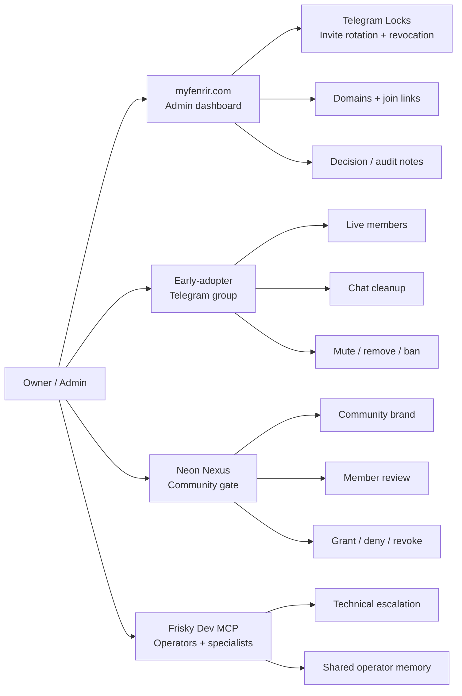
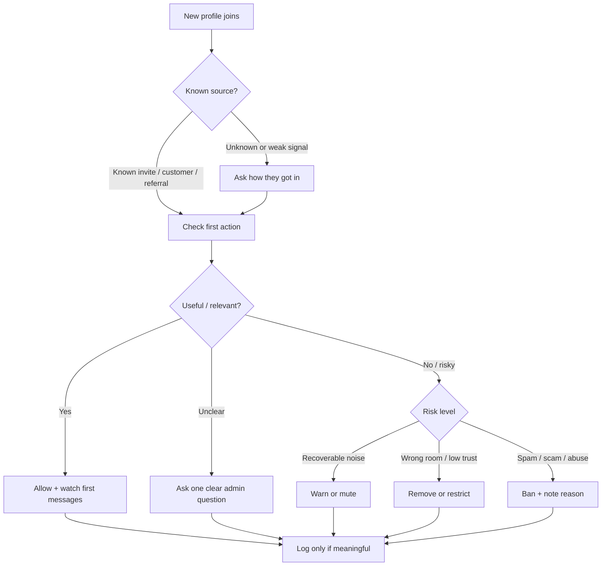
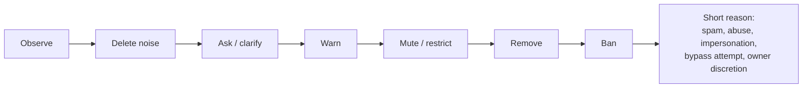
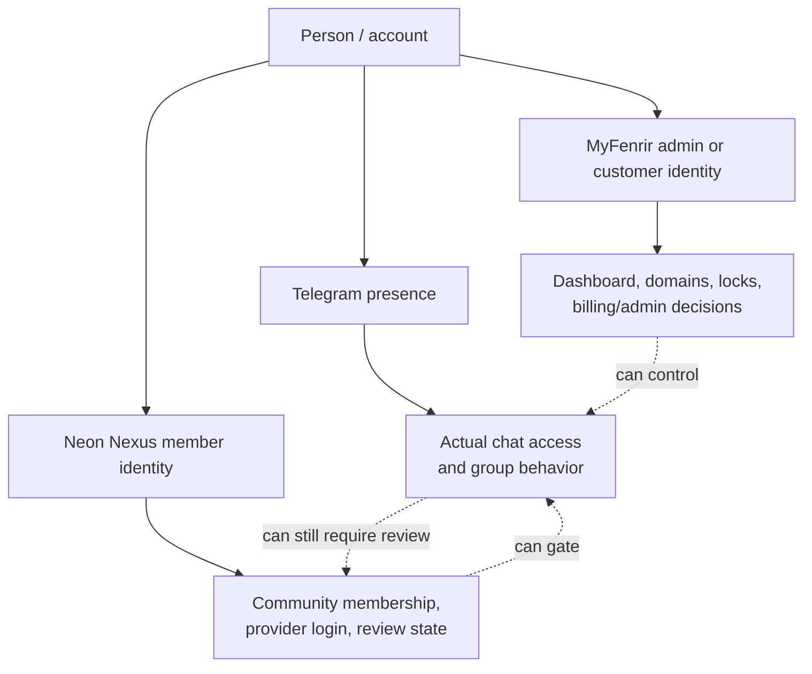

# MyFenrir Admin Guide

This guide defines the working admin role for `myfenrir.com`, the early-adopter Telegram group, and the Neon Nexus community gate.

It is written for the owner/admin who has to make real calls: reviewing new people, keeping the chat usable, removing spam, banning people when needed, and deciding when a profile or group is ready for the next access tier.

Launch status: private alpha / controlled beta is allowed. Paid public launch is blocked until the launch gate in `docs/MYFENRIR_ALPHA_LAUNCH_GATE.md` is satisfied.

## Admin Role

You are the owner-operator of the MyFenrir community layer.

Your job is not to act like a neutral robot. Your job is to protect the product, the early adopters, the community signal, and the people already inside the group. You can use judgment, taste, and opinion. The only discipline is this: when you make a hard call, leave a short reason that another trusted operator could understand later.

You own:

- who gets reviewed as an early adopter
- who can stay in the active Telegram group
- what behavior is tolerated in chat
- when a person is muted, warned, removed, or banned
- which group or profile becomes a Neon Nexus community
- which issues get escalated to technical, billing, legal, or safety review

You do not need to wait for an automated system before acting on obvious abuse, spam, scams, harassment, or behavior that damages the group.

## System Map

MyFenrir has several connected surfaces, but they are not the same thing.

| Surface                      | Purpose                        | Admin meaning                                                                                |
| ---------------------------- | ------------------------------ | -------------------------------------------------------------------------------------------- |
| `myfenrir.com`               | Main product/admin surface     | Where owner/admin identity, dashboard decisions, domains, locks, and product operations live |
| Early-adopter Telegram group | Active community/testing group | The live social space you moderate and protect                                               |
| Telegram Lock / Fenrir Gate  | Access bridge into Telegram    | Controls invite rotation, revocation, and stable public join links                           |
| Neon Nexus                   | White-label community gate     | Separate community auth/brand flow for groups that need a real gated community               |
| Frisky Dev MCP               | Operator/specialist layer      | Support system for routing tasks, specialists, memory, and builder workflows                 |

Keep this split clear: MyFenrir admin identity is the owner/operator side. Neon Nexus is the member/community verification side. A person can be valid in one context and still need review in the other.

## Diagrams

These diagrams are the quick visual map for the admin role. They can be pasted into any Mermaid-compatible docs surface, or used as the storyboard for a Remotion explainer.

### Admin Surface Map



### New Profile Review



### Moderation Ladder



### MyFenrir vs Neon Nexus vs Telegram



## Early-Adopter Group

The early-adopter group is the practical first community. Treat it as a protected beta room, not as a public free-for-all.

The group is for:

- people testing Fenrir/MyFenrir access flows
- trusted builders and operators
- invited customers or partners
- early community members who understand that things are still being shaped

The group is not for:

- spam drops
- cold solicitation
- harassment or hostile debate
- impersonation
- people trying to bypass payment, identity, or community checks
- users who repeatedly create work for admins without adding value

When someone asks "what group are we using for early adopters?", answer with the current official early-adopter Telegram group link or invite route, not a raw backend detail. If the link is managed through Fenrir, prefer the stable Fenrir join/lock URL over posting a permanent Telegram invite.

## New Profile Review

When a new profile appears, review it in this order.

1. Identity signal

Look for a recognizable name, username, profile photo, linked account, referral source, payment/customer status, or existing relationship. Weak identity does not automatically mean bad, but it means slower trust.

2. Source

Check how they arrived. Strong sources include direct invite, known admin referral, customer onboarding, event/test cohort, or a Fenrir managed join route. Unknown public links deserve more attention.

3. Intent

Look at their first actions. Good early-adopter behavior usually looks like asking a relevant question, introducing themselves, testing a flow, reporting a bug, or quietly observing. Bad intent often shows up as links, repeated DMs, crypto/scam language, aggressive self-promotion, or demands for access.

4. Risk

Decide whether they are low risk, needs watch, needs manual verification, or should be removed.

5. Record

For meaningful decisions, keep a short note: profile, action, reason, date, and who made the call. Do not store private secrets, tokens, or unnecessary personal data in notes.

## Moderation Actions

Use the lightest action that protects the room.

| Action         | Use when                                          | Admin note                                                                                     |
| -------------- | ------------------------------------------------- | ---------------------------------------------------------------------------------------------- |
| No action      | New profile looks normal                          | Let them settle in                                                                             |
| Watch          | Weak signal but no harm yet                       | Keep an eye on first messages                                                                  |
| Ask            | Intent is unclear                                 | Ask how they got in or what they need                                                          |
| Warn           | Behavior is annoying but recoverable              | Keep it short and clear                                                                        |
| Delete message | Spam, noise, unsafe link, duplicate clutter       | Clean the room without drama                                                                   |
| Mute/restrict  | Person is disruptive but may be recoverable       | Use when cooling off is enough                                                                 |
| Remove/kick    | Person should leave now but ban is not required   | Good for wrong-room or low-trust cases                                                         |
| Ban            | Person should not come back through the same path | Use for abuse, scams, harassment, impersonation, repeated boundary crossing, or owner judgment |

Your opinion is a valid input. The standard is not "can I prove this in court?" The standard is "does keeping this person create avoidable risk, noise, or harm for the group?"

For bans, write a short reason such as:

```text
Ban: spam link on first message
Ban: repeated harassment after warning
Ban: impersonation risk
Ban: owner discretion, bad-fit behavior
Ban: bypass attempt against managed invite flow
```

## Chat Cleanup

The chat should stay useful for real operators and early adopters.

Clean up:

- spam links
- repeated promo posts
- irrelevant walls of text
- duplicate bug reports after they are captured
- exposed secrets, tokens, private links, or customer data
- arguments that are no longer producing useful signal
- outdated invite links if Fenrir has rotated the active route

Do not over-explain every cleanup in public. If a deletion could confuse trusted members, add one calm admin note:

```text
Cleaned a spam/off-topic thread to keep the beta room readable.
```

## Ban Policy

Bans are allowed when your judgment says the person is bad for the room or product.

Ban immediately for:

- scam links or suspicious financial pitches
- impersonation
- harassment, threats, or targeted abuse
- attempts to bypass access controls
- posting private data, secrets, or invite links after being told not to
- repeated spam or bot-like behavior
- behavior that makes early adopters less safe or less willing to participate

Ban by owner discretion for:

- bad-faith participation
- repeated social friction
- people who create too much admin load
- users who are technically not violating one rule but are clearly wrong for the group

When in doubt, remove first and review later. The community does not owe unlimited access to someone who is making the room worse.

## Neon Nexus Admin Meaning

Neon Nexus is the white-label gated community layer. It is not just "the Telegram group."

Use Neon Nexus when a group needs:

- a branded public gate
- provider-based member login
- organization or group-level separation
- reviewable member access
- a stronger audit trail
- community-specific branding and copy
- a higher-trust gate than a raw Telegram invite

Neon Nexus should stay separate from normal MyFenrir admin auth.

The expected split is:

- MyFenrir admin/customer identity: owner and operator dashboard access
- Neon Nexus member identity: community member verification and access
- Telegram membership: the actual group/channel presence

Do not collapse those into one mental model. A person can be a MyFenrir customer, a Neon Nexus community owner, a community member, or a Telegram participant. Those roles overlap, but they are not identical.

## Neon Nexus Review Flow

For a Neon Nexus community, review members by:

1. Provider identity

Google, Apple, or Microsoft login is the normal primary identity signal. Magic link can be fallback/recovery, not the main premium flow.

2. Community fit

Check whether the person belongs in that specific community or group.

3. Role

Decide whether they are a member, owner, staff, reviewer, or blocked user.

4. Access state

Use clear states:

```text
pending
granted
denied
flagged
revoked
```

5. Audit

Important reviews should create an audit trail with the action and reason.

## Practical Daily Workflow

Start of day:

- check new joins and pending profiles
- scan the latest chat for spam, exposed private info, and unanswered high-signal questions
- check whether any Telegram invite links need rotation
- review failed or suspicious access attempts if available
- note product bugs separately from moderation issues

During the day:

- delete obvious spam quickly
- respond to genuine early adopters
- turn repeated questions into docs or product tasks
- capture blockers with screenshots, URLs, or exact error text
- escalate technical issues to the Fenrir/Frisky operator workflow

End of day:

- summarize bans, removals, and unresolved profile reviews
- list product bugs separately from social/admin decisions
- decide which early adopters need follow-up
- rotate or revoke links if the group had suspicious traffic

## Escalation Rules

Escalate to technical/operator review when:

- the Fenrir join route does not work
- login loops or callback errors appear
- Telegram webhook or bot checks fail
- invite rotation/revocation does not apply
- Neon Nexus member state does not match Telegram access
- audit logs are missing for a serious action

Escalate to billing/product review when:

- access depends on plan tier
- a customer says they paid but cannot enter
- a high-tier Neon Nexus community needs activation
- an owner wants staff/reviewer rights

Escalate to legal/safety review when:

- threats, doxxing, fraud, payment disputes, or illegal content appear
- someone requests private user data
- a ban could become a formal dispute

## Admin Decision Log Template

Use this lightweight format for meaningful actions:

```text
Date:
Admin:
Surface: MyFenrir / Telegram / Neon Nexus
Profile or handle:
Action: watch / warn / delete / mute / remove / ban / grant / deny / revoke
Reason:
Evidence:
Follow-up:
```

Keep it short. The point is accountability, not paperwork.

## Public Admin Language

Use calm, short admin messages.

For unclear profile:

```text
Hey, quick admin check: how did you get into this early-adopter group and what are you here to test?
```

For cleanup:

```text
Cleaned a few off-topic/spam messages so the beta room stays readable.
```

For boundary:

```text
This group is for MyFenrir/Fenrir early access and testing. Keep links and promotion out unless an admin asks for them.
```

For removal:

```text
Removing this account from the early-adopter group. If this was a mistake, use the official MyFenrir access path again for review.
```

For Neon Nexus:

```text
This community uses Neon Nexus review. Access is based on the community owner/admin decision, not just joining the Telegram chat.
```

## Telegram Posts

Use these when you need something polished for the group.

### Early-Adopter Welcome

```text
Welcome to the MyFenrir early-adopter group.

This is the live testing room for Fenrir/MyFenrir: access gates, Telegram locks, Neon Nexus community flows, and the admin experience around them.

Please keep the group focused:
- introduce yourself if you are new
- share bugs with clear screenshots or exact steps
- keep promo links and unrelated drops out
- do not repost private invite links
- respect admin cleanup and access decisions

This group is protected. Admins may delete noise, restrict accounts, remove people, or ban at owner discretion when something feels unsafe, spammy, or bad for the room.

If you are here to help shape the product, welcome in.
```

### Short Group Rules

```text
MyFenrir early-adopter rules:

1. Stay on Fenrir/MyFenrir, Telegram access, Neon Nexus, and product testing.
2. No spam, cold promo, suspicious links, or DM fishing.
3. Do not share private invite links outside the group.
4. Report bugs with screenshots, URLs, and exact steps when possible.
5. Admins can clean, mute, remove, or ban to protect the room.

The point is simple: keep the signal high and make the product better.
```

### New Member Check

```text
Quick admin check for new profiles:

Please reply with who invited you or what you are here to test in MyFenrir.

This is an early-adopter room, so we review new joins and keep access protected.
```

### Neon Nexus Explanation

```text
Small clarification on Neon Nexus:

MyFenrir is the admin/product side.
Neon Nexus is the gated community identity layer.
Telegram is the live group/chat space.

Those are connected, but they are not the same thing. A member may need review before they get community access, even if they already found the chat.
```

### Cleanup Notice

```text
Admin cleanup note:

I removed a few messages/accounts to keep the early-adopter room useful and safe.

If you are here for MyFenrir testing, product feedback, or Neon Nexus community access, you are good. Keep it focused and we keep moving.
```

### Ban Boundary

```text
Access reminder:

This group is not public-open. Spam, suspicious links, impersonation, harassment, invite bypassing, or repeated bad-fit behavior can lead to removal or ban at admin discretion.

We are protecting the early-adopter group so real members can build, test, and give useful feedback.
```

## What Admin Success Looks Like

The room feels alive but not chaotic.

New people know whether they are pending, accepted, or not a fit. Early adopters can talk without spam taking over. Product bugs get captured instead of lost in chat. Bans are decisive without being messy. Neon Nexus communities have separate member review instead of being treated like one big public Telegram invite.

Your role is to keep that shape intact.
